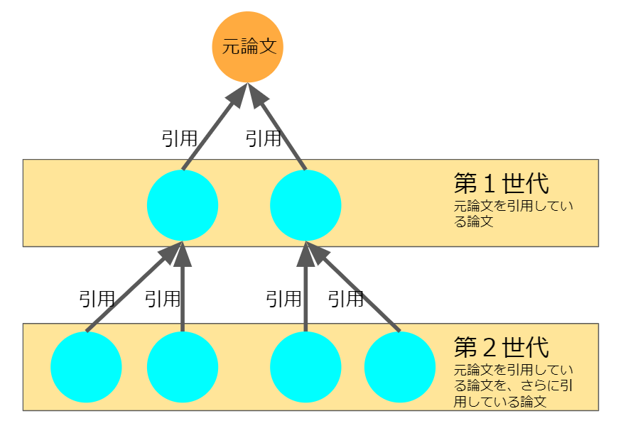

# PressReleaseVis
プレスリリースを可視化

[COCI](https://opencitations.net/index/coci)データを使ったテストとして、プレスリリースの成果論文を可視化。  
2021/12/15現在は以下の2研究機関のものを作成しています。    

[JST2018年度](JST2018)  
[理研2018年](riken2018)  

## 概要

研究成果プレスリリースの成果元論文から、その論文を引用している論文の情報(第１世代)、引用している論文をさらに引用している論文(第２世代)について分析・可視化をしたものです。  
論文の情報(タイトルや著者などのメタデータ)、引用の情報は、[COCI, the OpenCitations Index of Crossref open DOI-to-DOI citations](https://opencitations.net/index/coci)のデータを使っています。  
論文の雑誌情報は、[Scimago Journal & Country Rank](https://www.scimagojr.com/)を利用しています。  
  
本分析で対象とした研究機関や2018年度(または2018年)を選択していることには意図はなく、プレスリリースから成果論文のDOIが簡単に抽出できそうなもの、ある程度の引用がすでにある(古すぎると引用が多すぎてしまう可能性も考慮)と考えられる発行日であることなどを考えて選択しています。  
__分析内容はプレスリリース元の各研究機関とは一切の関係はありません。__  

---------------------------------------

## 各項目の説明

### 元論文情報

成果論文そのものの情報です。

### 元プレスリリース情報

元のプレスリリースそのものの情報です。

### データ取得日  

データ取得日(COCI API)です。

---------------------------------------

### 発行年ごと論文数

第１世代もしくは第２世代の論文群について、発行年毎に数を示したものです。  
論文群のいくつかは、発行年不明のものが含まれています。  

### 著者正規化top50

第１世代もしくは第２世代の論文群について、著者名を正規化(スペース・記号・Orcid番号を除外)したもので、数が多いものから50件を抽出したものです。  
イニシャル表記とフルネームでの表記(例:Katsutaro. Watanabe と K. Watanabe)などは判断がつかないため別人として扱われています。  

### 著者正規化top50の共著関係

著者正規化top50の著者について、第１世代もしくは第２世代の論文群における共著関係を可視化したものです。

### タイトル語top50

第１世代もしくは第２世代の論文群について、タイトルの語(単純にスペースで区切り)を数が多いものから50件を抽出したものです。  

### タイトル語top50の共起

タイトル語top50の語について、第１世代もしくは第２世代の論文群における共起関係を可視化したものです。

### ジャーナル一覧

第１世代もしくは第２世代の論文群について、その雑誌名の一覧です。  
論文群のいくつかは、Scimagoにない(書籍など)ため含まれていません。  

### ジャーナル分野比率

ジャーナル一覧にあるものをScimagoの分野分類に従って数えたものです。

## 利用しているデータソース

- [REST API FOR COCI, THE OPENCITATIONS INDEX OF CROSSREF OPEN DOI-TO-DOI REFERENCES](https://opencitations.net/index/coci/api/v1). データ取得日はファイルごとに異なる。
- [Scimago Journal & Country Rank](http://www.scimagojr.com), retrieved 2021-09-12.
